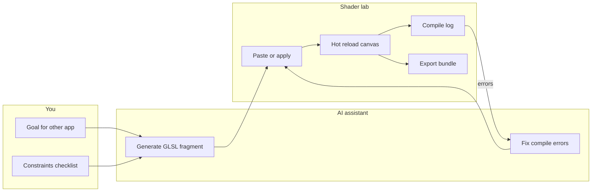

# AI Collaboration — Shader Lab Workflow

**Purpose:** Use this repository as a **human + model** workspace to generate, validate, and export GLSL fragments for **other applications** (games, WebGL sites, React Three Fiber, etc.).  
**Companion:** [PRD.md](./PRD.md) (product intent), [ROADMAP.md](./ROADMAP.md) (milestones).

---

## 1. What “collaborative” means here (v1)

- **Collaboration** = you and an AI assistant in chat, with the playground as **ground truth** for compile errors and pixels.
- **Not in scope for v1:** multi-user real-time co-editing, shared sessions, or cloud persistence (see ROADMAP if that becomes a goal).

High value comes from a tight loop: **goal → generate → paste → compile feedback → fix → export** to your target app.

---

## 2. Target UX (mock-up)

**Intent:** One surface to **run** a fragment, **edit** (paste from AI or type), **read compile output**, and **export** a small contract for downstream apps—without becoming a full IDE.

### 2.1 Wireframe

```text
┌──────────────────────────────────────────────────────────────────────────┐
│  ASA Shader Lab          [Shader ▼]  [Reset]  [Copy share stub]  [Export] │
├───────────────────────────────┬──────────────────────────────────────────┤
│                               │  ASSISTANT / NOTES                        │
│   FULL-VIEWPORT CANVAS        │  ┌──────────────────────────────────────┐ │
│   (glslCanvas)                │  │ Target app: [WebGL ▼] [R3F ▼] …       │ │
│                               │  │ Constraints: WebGL1, no texture3D…   │ │
│                               │  └──────────────────────────────────────┘ │
│                               │  Prompt scratchpad (markdown ok)          │
│                               │  ┌──────────────────────────────────────┐ │
│                               │  │ Paste Claude / ChatGPT output here   │ │
│                               │  │ → [Apply to editor]                  │ │
│                               │  └──────────────────────────────────────┘ │
│                               │  Compile log (last build)                 │
│                               │  • ERROR line 42: undefined `foo`         │
├───────────────────────────────┴──────────────────────────────────────────┤
│  FRAGMENT EDITOR (collapsible)  [Format] [Validate] [Diff vs last AI]      │
│  ┌──────────────────────────────────────────────────────────────────────┐ │
│  │ precision mediump float;                                              │ │
│  │ uniform float u_time;                                                 │ │
│  │ void main() { ... }                                                   │ │
│  └──────────────────────────────────────────────────────────────────────┘ │
└──────────────────────────────────────────────────────────────────────────┘
```

### 2.2 Flow



---

## 3. Constraint card (paste before every generation)

Give the model the same short preamble so outputs stay portable:

- **Runtime:** WebGL 1–style fragment shader suitable for a full-screen quad (e.g. `glslCanvas`). No WebGPU.
- **Uniforms (lab baseline):** `u_time` (`float`), `u_resolution` (`vec2`, pixels). Optional: `u_mouse` (`vec2`), `u_texture0` (`sampler2D`) only if your lab actually binds a texture.
- **Shadertoy:** Do not assume `iResolution` / `iTime` / `iChannel0` without translating to your uniform names.
- **Scope:** One clear visual goal (e.g. “soft vignette + subtle film grain”), not ten features at once.

Adjust the list when your playground’s real uniforms differ; keep it **one canonical table** in code or README.

---

## 4. Export stub (for other applications)

When a shader works in the lab, capture more than raw GLSL:

| Field | Example |
|--------|---------|
| **Uniform contract** | Names, types, units (`u_resolution` in px, UV in 0–1, etc.) |
| **Precision** | `mediump` vs `highp` notes if you hit banding |
| **Inputs** | Procedural only vs requires texture / external buffer |
| **Assumptions** | Alpha handling, premultiplied vs straight, Y-flip |
| **Target** | “Drop into R3F `shaderMaterial`” vs “raw `initShader` pair” |

A one-paragraph handoff block is often enough for your other repo’s agent or for you to paste manually.

---

## 5. Prompt patterns

- **Translate, don’t invent:** “Convert this Shadertoy snippet to uniforms `u_time`, `u_resolution`; remove or replace `iChannel*` with procedural noise.”
- **Error-first:** Paste **compile log** + **current fragment**; ask for a **minimal diff**, not a full rewrite.
- **Visual spec:** “Calm, low-frequency motion; avoid strobing; keep work reasonable on mobile GPUs.”

---

## 6. Quick validation checklist (after AI output)

| Symptom | Likely cause |
|---------|----------------|
| Black screen | Wrong `gl_FragColor` / alpha; UV out of range |
| Wrong scale | Aspect: mixing pixel coords with 0–1 UV without `u_resolution` |
| Harsh flicker | `sin(u_time * large)` without clamping or smoothing |
| Banding on gradients | `mediump` precision; try local `highp` in critical lines (within ES limits) |

---

## 7. Workshop formats (creative iteration)

- **10-minute rounds:** Model produces 3 variants → you pick one → one round of “reduce complexity / cost.”
- **Mood board → shader:** 1–2 reference stills + 3 adjectives; ask for motion that matches **only** those adjectives.
- **Porting drill:** Take a tiny known-good shader from another app, break it intentionally in the lab, practice **fix from compile log only** with the model.

---

## 8. External resources

- **[The Book of Shaders](https://thebookofshaders.com/)** — Concepts and 2D patterns; shared vocabulary for workshops.
- **[Shadertoy](https://www.shadertoy.com/)** — Reference implementations; always plan an explicit **translation** step to your uniforms and WebGL1 limits.
- **[Khronos GLSL ES 1.00 specification](https://registry.khronos.org/OpenGL/specs/es/GLSL_ES_Specification_1.00.pdf)** — Authoritative for builtins and precision rules.
- **[MDN: WebGL API](https://developer.mozilla.org/en-US/docs/Web/API/WebGL_API)** — Pipeline context when moving shaders out of the lab.

---

## 9. PRD alignment

- **Phase A–B:** Collaboration is primarily **documented workflow** (this file) plus whatever minimal UI the playground adds (picker, optional editor, compile log).
- **Phase C:** URL state, presets, richer layers—see [PRD.md](./PRD.md) Appendix A and [ROADMAP.md](./ROADMAP.md); multi-user or backend sharing is out of scope until explicitly scheduled.

---

## 10. Open questions (resolve as the lab grows)

1. Canonical uniform names and whether the editor enforces them.
2. Whether “Export” generates TypeScript, raw GLSL, or both.
3. Whether Shadertoy import becomes a one-click translate (scope creep—gate behind a milestone).
